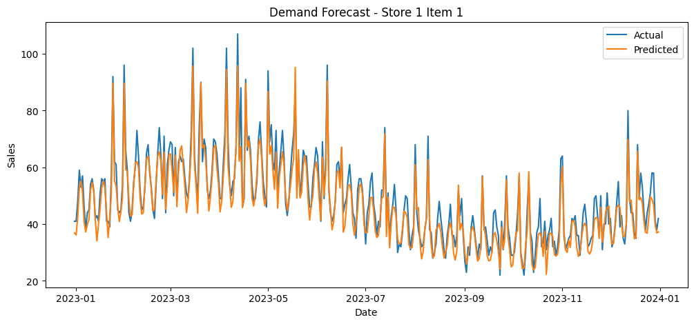

# Demand Forecasting for Supply Chain Optimization

Data-driven demand forecasting project that shows how better predictions can support lower inventory risk and more efficient replenishment planning.

This project uses retail sales data to forecast product demand and translate the forecast into inventory decisions. Instead of stopping at model accuracy, it connects prediction output to safety stock and reorder point planning.

Portfolio hub: [Mindeulaeggot/data-analytics-portfolio](https://github.com/Mindeulaeggot/data-analytics-portfolio)

This project is positioned to support both data analytics internship applications and SCM internship applications because it combines model evaluation with supply chain decision-making.

## 1. Problem

Retail operations face two costly risks:

- understocking, which causes stockouts and lost sales
- overstocking, which increases holding cost and waste

The goal of this project is to predict future demand and show how forecasting can support better inventory planning.

## 2. Business Impact

- lower stockout risk by identifying expected demand more accurately
- reduce excess inventory by avoiding over-ordering against weak forecasts
- support more disciplined replenishment planning through reorder point logic
- connect data analysis to operating decisions instead of ending at model output
- demonstrate how demand forecasting can be used in inventory control and supply planning workflows

## 3. Data

- Source file: `data/retail_sales.csv`
- Time range: `2019-01-01` to `2023-12-31`
- Scale: about `4.57 million` rows
- Coverage: `50` stores and `50` items
- Example forecasting case: `store_1 / item_1`

## 4. Method

The workflow is split into three notebooks:

1. [01_eda.ipynb](./notebooks/01_eda.ipynb)
   Explores sales patterns, seasonality, and data quality.
2. [02_forecasting.ipynb](./notebooks/02_forecasting.ipynb)
   Compares baseline forecasting, Linear Regression, and Random Forest.
3. [03_inventory_policy.ipynb](./notebooks/03_inventory_policy.ipynb)
   Converts predicted demand into safety stock and reorder point recommendations.

Main methods used:

- exploratory data analysis
- feature engineering for time-based demand patterns
- Linear Regression
- Random Forest
- MAE and RMSE for forecast evaluation
- inventory policy logic using lead time and service level assumptions

## 5. Result

Example results for `store_1 / item_1`:

| Metric | Result |
|---|---:|
| Baseline MAE | `11.73` |
| Linear Regression MAE | `7.33` |
| Random Forest MAE | `3.64` |
| Lead Time | `7 days` |
| Service Level | `~95%` |
| Safety Stock | `60.46` |
| Reorder Point | `386.58` |

The forecast error dropped from `11.73` MAE with the baseline model to `3.64` with Random Forest, a `69.0%` reduction in MAE.

RMSE also improved from `15.71` to `4.52`, a `71.2%` reduction, which shows that the final model reduced larger prediction errors as well.

This means the project did not stop at "modeling worked." It showed a measurable improvement in forecast quality that can support better reorder timing and inventory planning decisions.

## 6. Insight

- The Random Forest model substantially outperformed the baseline forecast on the sample series.
- Demand forecasting became more useful once it was converted into an inventory decision rule tied to safety stock and reorder point.
- The project shows that analytics value comes not only from prediction quality, but from how the prediction changes inventory planning and replenishment decisions.
- Seasonal and series-level demand variation suggests that a fixed inventory rule is weaker than a forecast-informed approach.

## 7. Forecast Visualization

Below is the actual versus predicted demand plot from the forecasting notebook for the sample series:



## Why This Works As a Portfolio Project

- It shows a clear business problem, not just a model.
- It uses a large real-world style retail dataset.
- It includes measurable model improvement.
- It ends with business actions: safety stock and reorder point.

For data analytics roles, it shows exploratory analysis, model comparison, and quantitative evaluation.

For SCM roles, it shows how analytics can inform inventory planning, reorder decisions, and operational tradeoffs.

## Operational Takeaway

The main takeaway is not just that one model scored better. It is that forecast output can be turned into a practical replenishment rule:

- estimate upcoming demand
- buffer uncertainty with safety stock
- trigger replenishment at a data-informed reorder point

That is the step that makes the project relevant to real SCM work rather than only coursework.

In practical terms, this project suggests that demand-forecast-driven inventory planning can help reduce stockout risk, control excess inventory, and improve supply planning efficiency.

## Tech Stack

- Python
- pandas
- numpy
- matplotlib
- scikit-learn
- Jupyter Notebook

## Repository Structure

```text
scm-demand-forecast-inventory-optimization/
|-- data/
|   |-- retail_sales.csv
|   `-- PUT_RETAIL_SALES_CSV_HERE.txt
|-- notebooks/
|   |-- 01_eda.ipynb
|   |-- 02_forecasting.ipynb
|   `-- 03_inventory_policy.ipynb
|-- requirements.txt
`-- README.md
```

## How To Run

```bash
pip install -r requirements.txt
```

Then run the notebooks in this order:

1. `notebooks/01_eda.ipynb`
2. `notebooks/02_forecasting.ipynb`
3. `notebooks/03_inventory_policy.ipynb`

## Resume Bullet Version

- Built a retail demand forecasting project on `4.57M+` sales records and compared baseline, Linear Regression, and Random Forest models.
- Reduced MAE from `11.73` to `3.64` and RMSE from `15.71` to `4.52` on a sample store-item series.
- Translated forecast output into inventory recommendations through safety stock and reorder point analysis.

## Next Upgrade

- expand from one sample series to multiple store-item combinations
- compare with stronger time-series-specific models
- add cost-based inventory tradeoff analysis
